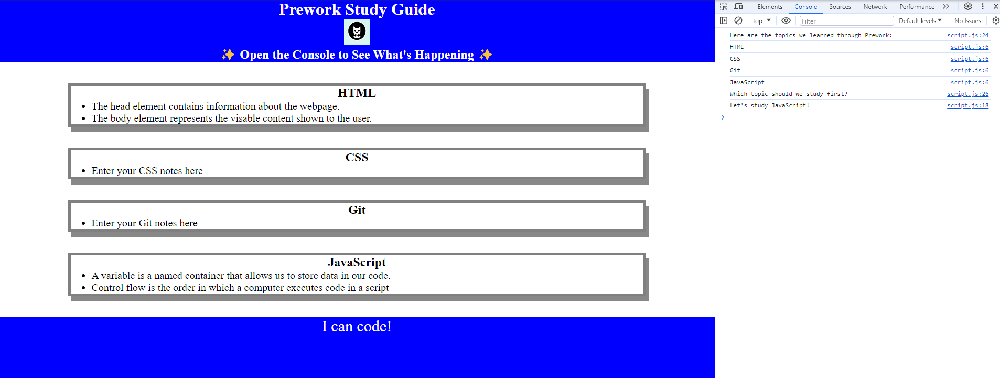

# <Prework Study Guide>

## Description

This website exists to help boot camp students organise and find information to study for the course

## Table of Contents

- [Installation](#installation)
- [Usage](#usage)
- [Credits](#credits)
- [License](#license)
- [Tests](#tests)

## Installation

N/A

## Usage

To use this study guide, inspect the webpage in your browser (R-Click > Inspect) and a list of covered topics will appear in the console, as well as a suggestion on what to study next. It should look like the following:

## Credits

Benjamin Rice [https://github.com/BenJR546]

## License

Please refer to the LICENSE in the repo.

## Tests

Refresh the page and ensure the "Let's Study" portion in the console changes.
